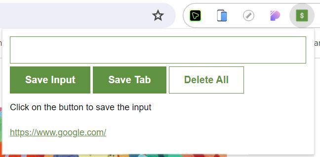

# Leads Tracker Chrome Extension

## Overview

Welcome to the Leads Tracker Chrome Extension project! As a developer, I embarked on this journey to not only create a useful tool but also to delve into the fascinating world of extension development. This extension empowers users to effortlessly save their favorite website links, providing a convenient way to revisit them later. Crafted with HTML, CSS, and JavaScript, the project not only offers a simple and efficient solution for tracking and managing leads but also represents a significant milestone in my learning journey in extension development.

### Table of Contents

- [Installation](#installation)
- [Repository](#repository)
- [How to use](#how-to-use)
- [Technologies Used](#technologies-used)
- [Features](#features)
- [Project Structure](#project-structure)
- [Future Enhancements](#future-enhancements)
- [Credits](#credits)
- [License](#license)
- [How to Contribute](#how-to-contribute)
- [Contact](#contact)



## Installation

To use this Leads Tracker Chrome Extension project, follow these steps:

1. Clone this repository or download the ZIP file.

2. Open Google Chrome and go to `chrome://extensions/`.

3. Enable "Developer mode" in the top right.

4. Click on "Load unpacked" and select the folder where you cloned or unzipped the extension.

5. The Leads Tracker Chrome Extension icon should appear in your Chrome toolbar.

## Repository

[Leads Tracker Chrome Extension Repository](https://github.com/m-ramzan786/Leads_Tracker-Chrome-Extension)

## How to Use

To use the Leads Tracker Chrome Extension:

1. Install the extension in your Google Chrome browser.

2. Open the extension popup by clicking on the extension icon.

3. Enter a website link in the input field and click "Save Input."

4. Save the currently opened or active tab's link with the "Save Tab" button.

5. Double-click on "Delete All" to clear all saved links.

## Technologies Used

- HTML
- CSS
- JavaScript

## Features

- **Save Input Button:** Enter a website link in the input field and click "Save Input" to store it.

- **Save Tab Button:** Save the currently opened or active tab's link by clicking "Save Tab."

- **Delete All Button:** Double-click on "Delete All" to clear all saved links.

## Project Structure

The extension is designed for a user-friendly experience, featuring a clean and minimalistic design.

## Future Enhancements

- **Category Organization:** Add the ability to categorize and organize saved links.

- **Import/Export:** Implement options for importing and exporting saved links.

- **One by One Delete:** Allow users to delete saved links individually for more flexibility.

## Credits

This project was developed with the support of [Scrimba](https://scrimba.com/), an interactive learning platform for web development.

## License

This project is licensed under the [MIT License](LICENSE). Feel free to use and modify the code as per the license terms.

## Badges


## How to Contribute

If you'd like to contribute to the project, follow these steps:

1. Fork the project.
2. Create a new branch for your feature: `git checkout -b feature-name`.
3. Commit your changes: `git commit -m 'Add new feature'`.
4. Push to the branch: `git push origin feature-name`.
5. Open a pull request.

## Contact

If you have any questions, suggestions, or just want to connect, feel free to reach out:

- Email: [mramzanstv@gmail.com](mramzanstv@gmail.com)
- Portfolio: [Muhammad-Ramzan-Portfolio](https://muhammad-ramzan.vercel.app/)
- LinkedIn: [in/m-ramzan786](https://www.linkedin.com/in/m-ramzan786/)

## Tests

The project includes a set of tests to ensure the functionality is working as expected. To run the tests, use the following command:
```bash
npm test
```

Effortlessly track and manage your leads with the Leads Tracker Chrome Extension!
